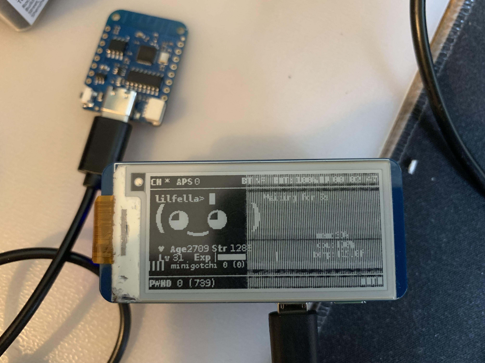

# minigotchi - ミニゴッチ

</img>
</img>

</img>
</img>

## An even smaller Pwnagotchi.

</img>

### Intro

This is a project meant to showcase the use of low-level Wi-Fi frame manipulation in a _Pwnagotchi-like_ matter with an ESP8266/ESP32. This firmware is designed with simplicity just as much as similarity to the Pwnagotchi, promoting configuration reusability, low(er) memory usage, and a _little bit_ of mischief.

The Minigotchi can detect _Pwnagotchis_, and send "advertisements" for another _Pwnagotchi_ to detect, along with deauthenticating devices connected to an AP. Originally meant to just befriend a local Pwnagotchi, I plan to improve it and extend its purpose, merely with an ESP8266 with 4 MB of memory.

We just made a [discord server](https://discord.gg/EhTAr7PwVP)! Feel free to join!

### Install guide

See the [install guide](INSTALL.md).

### Languages

The code is written in these languages.

- _C_
- _C++_

Note that the _C++_ in Arduino is slightly modified from what I have heard. See [this Reddit question](https://www.reddit.com/r/arduino/comments/x46sml/is_arduino_programming_language_c/) for more about this. Arduino probably has tweaked it to be more beginner-friendly, although still being [low-level](https://en.wikipedia.org/wiki/Low-level_programming_language). The _Pwnagotchi_ is a complex machine written in _Python_ and _Go_, so code from the Pwnagotchi Project is **not** compatible with mine.

### Prerequisites

- Arduino IDE
- A good understanding of coding/programming
- D1 Mini ESP8266 V4(or any other supported hardware in the [wiki](https://github.com/Pwnagotchi-Unofficial/minigotchi/wiki/Hardware))
- A reliable and appropriate power source and supply for the hardware
- Patience (a lot of it)
- The ability to read

### How it operates/works

See the [wiki](https://github.com/Pwnagotchi-Unofficial/minigotchi/wiki/How-the-Minigotchi-works).

### Hardware

See the [wiki](https://github.com/Pwnagotchi-Unofficial/minigotchi/wiki/Hardware).

### To do

See this [project](https://github.com/orgs/Pwnagotchi-Unofficial/projects/4).

### Contributing

See the Contributing Guidelines [here](CONTRIBUTING.md).

### FAQ

See the [wiki](https://github.com/Pwnagotchi-Unofficial/minigotchi/wiki/FAQ).

### Communication

See the [wiki](https://github.com/Pwnagotchi-Unofficial/minigotchi/wiki/Communication#communication).

### Last but not least... Some thank you's

**If you believe your project wasn't properly credited, please let me know ASAP! Here's how you can [communicate](https://github.com/Pwnagotchi-Unofficial/minigotchi/wiki/Communication#communication) with me.**

**Thanks to these projects for making this a little bit more possible for me, I have used libraries/code from these projects and implemented it here:**

- [Pwngrid](https://github.com/evilsocket/pwngrid), this is what the project is trying to replicate, specifically the Pwnagotchi's system of peer detection. If this didn't exist, this project probably wouldn't have either.

- [Arduino](https://github.com/esp8266/Arduino), mostly just the repository containing libraries for the project so I can build this code. Many libraries were used in this core repository.

- [80211Raw](https://github.com/tht/80211Raw) allows raw arbitrary frames to be received and sent through an ESP8266 or ESP32 using C and C++ in an interesting and useful POC. This was used to send the _Pwnagotchi-like_ frames. Most of the previous releases used this library, but now not anymore.

- [ESP8266 Deauther](https://github.com/SpacehuhnTech/esp8266_deauther/), the POC that shows that an ESP8266 can deauth and attack local access points. Deauthing is based on this project and is done in a very similar fashion. Not only that, but it can also send probes and create fake APs.

- [ESP32 Marauder](https://github.com/justcallmekoko/ESP32Marauder), similar to the ESP8266 Deauther, although packed with more features and support for Flipper Zero's ESP32 WiFi Card Module. It has wardriving capabilities, BLE, Pwnagotchi Scanning, and Deauthing available. This is a very cool project, I highly recommend checking this out if you have an ESP32.

- [ESPAsyncWebServer](https://github.com/lacamera/ESPAsyncWebServer), the library that allows a Web UI on the ESP8266, along with an AP.

- [Milkydeveloper](https://github.com/MilkyDeveloper), idk what he did but he wanted to be here ig so...(this is totally not an advertisement)

- [This is a set of projects](https://github.com/lpodkalicki/blog), one of which was an ESP32 sniffer.

- [esp8266-sniffer](https://github.com/kalanda/esp8266-sniffer), an ESP8266 sniffer dedicated to finding probes from smartphones.

**Made with ❤️ by [@dj1ch](https://github.com/dj1ch) and the rest of the Pwnagotchi-Unofficial team!**

